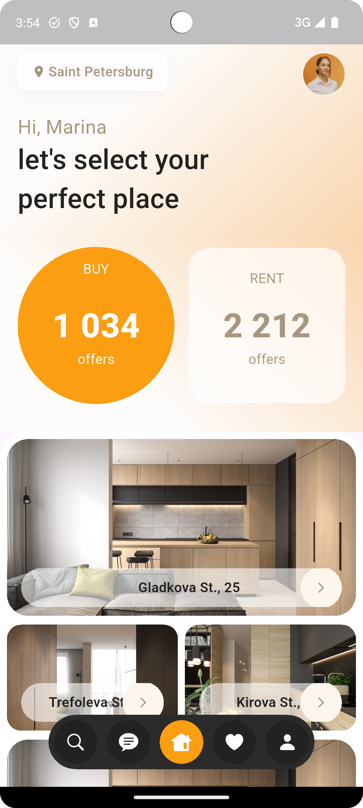
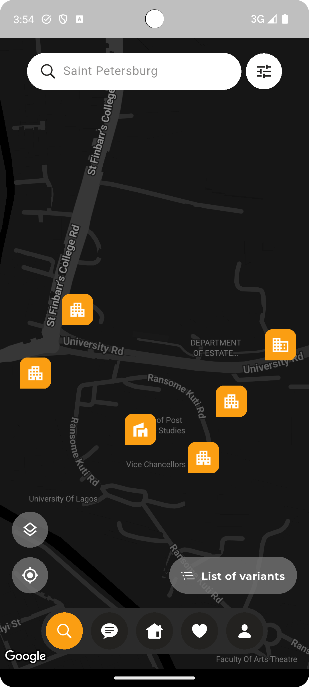

# Real Estate App - Design-to-Code Test

This is my submission for the design-to-code test, where I was tasked with translating a Dribbble design of a real estate app into a working mobile application.

## Project Overview

The goal was to accurately replicate the UI design, animations, and scroll behaviors from the Dribbble video into a fully functional mobile app. All screens and interactions visible in the video have been implemented.

[View Original Dribbble Design](https://dribbble.com/shots/23780608-Real-Estate-App)

## Screenshots

|  |  |
|:-----------------------------------:|:----------------------------------------:|
| Home Screen                         | Search Screen                            |


## Features Implemented

- Pixel-perfect UI: Recreated all UI elements including:
- Scroll Behaviors:
- Animations:
- Complete Asset Pipeline:
- Navigation Flow:

## Setup Instructions

### Prerequisites

- Flutter SDK (v3.16 or higher)
- Dart (v3.2 or higher)
- IDE (Android Studio/VSCode with Flutter plugin)

### Installation

1. Clone the repository:
   ```bash
   git clone https://github.com/Bert1041/dribbble_real_estate_ui.git
   ```

2. Install dependencies:
   ```bash
   flutter pub get
   ```

3. Run the app:
   ```bash
   flutter run
   ```

## Known Limitations

- Some animations may not be 100% frame-perfect compared to the Dribbble prototype
- Font weights are approximate due to licensing constraints
- Image loading could benefit from additional optimization

## License

MIT License - See [LICENSE](LICENSE) for details.
```
